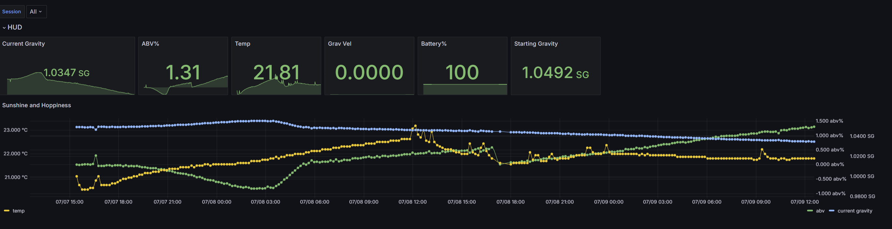
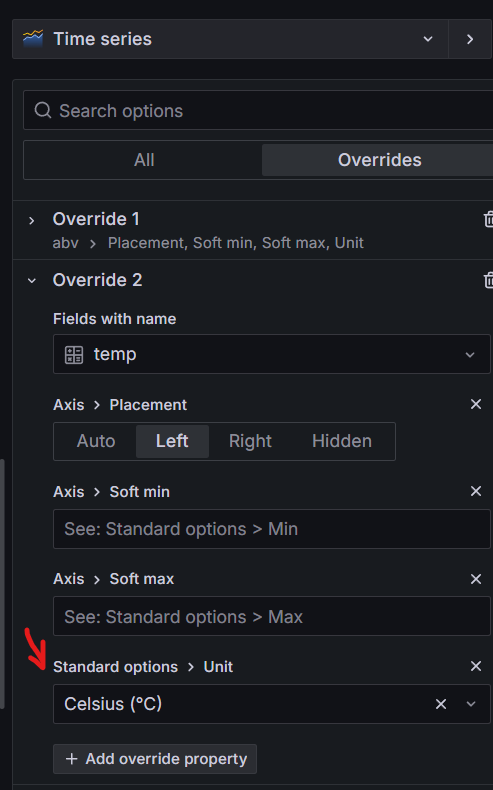

# Info

This repo should help people get the bluetooth low-energy data from their RAPT Pill devices

I've tested this with one Pill on a raspberry pi 4b+ as well as a windows 10 laptop, both worked fine for collecting the data

I also wanted to have my own graphs that I could look at while my fermentations are going so I added Grafana into the mix

## Basic Setup Steps (raspberry pi):
- pip install requirements.txt so you get the same version of bleak (this might not work in future versions)
- get Grafana self hosted setup in your system - I followed this to get grafana running on my pi - https://pimylifeup.com/raspberry-pi-grafana/
- install influxdb - https://pimylifeup.com/raspberry-pi-influxdb/  - choose if you're doing influxdb or influxdb2 as the setup steps are different as is the python code you will run later
- Set your influxdb up on grafana

If on a raspberry pi5 (at least) you might be told to create a virtual environment if you try to `pip install -r src/requirements.txt`
If this happens, you can do `python -m venv VE_Pill` - with VE_Pill being whatever you want to call it
You then do `source VE_Pill/bin/activate` which will activate your virtual environment. You may now do `pip install -r src/requirements.txt`


## influxdb V1 Setup
- Make sure you have installed influxdb  `pip install influxdb`
- if you have chosen to run influxdb v1 you can use the src/RaptPill_Decoder.py 
- If you want to just run the python script and not have to do any coding - in the src folder, create a file called data.json and use the json from the data.json section below to get you started.

## influxdb v2
- Make sure you have installed influxdb-client (pip install influxdb-client)
- If you want to just run the python script and not have to do any coding - in the src folder, create a file called data.json and put settings from the data.json information section inside it. 

# Grafana
## Data Source connection
Open Grafana (usually http://localhost:3000) and in menu, click connections and then data sources. Add a new data source of InfluxDb.

Set the name to something (I have done it as RaptPills) and set default to on
Query Language to InfluxQL (regardless of V1 or V2 of influxdb)

HTTP:
- url you have to literally type in http://localhost:8086

If using V1:

HTTP:
- leave all options default

InfluxDB Details:
Set Database to whatever you named yours 
set User to your user name and fill in your password

Leave http method, min time interval and max series as default

If using V2:

HTTP:
- Auth -> set basic auth on and fill in your username and your secret token in password

InfluxDBDetails
Database: fill in your bucket name

user: leave blank

password: fill in your secret token

HTTP Method: POST

leave min time and max series default

Hit save and test and hope everything works

# Dashboard Setup
In the menu, click Dashboards and if asked to create a new/import select Import

Navigate to the src/dashboards folder and select the json file there

Optionally give your dashboard a name and select the data source(the one you just setup)
Import

If you have any data already you should see them in the session dropdown at the top of the dashboard or already displayed. You may see graphs that don't show data and have a "Zoom to Data" button. Click the button to show the data for that session - it seems Grafana can only show us one graph of data at a time due to how it deals with time series


# data.json information

Below is the json that you can use to get started

Depending on if you are using influxdb v1 or v2 you will put the correct version number in `Database Version`

If you are using influxdb v1:
- Fill in your database name, username and password into the DatabaseV1 sections. You can leave DatabaseV2 sections empty or as default below.

If you are using influxdb v2:
- Fill in the DatabaseV2 sections with your org name, bucket and the secret token that you got when you setup the db originally. 

If you are tracking only one pill, you can just update the example session below, else copy it and fill in the details for each session you would like to track.

Mac Address: the mac address for your PILL - get this from the Rapt Portal 

Session Name: name of the brew you are doing - better to have this be unique so it can be filtered properly in grafana

Poll Interval: how many seconds should we poll for. Ideally if you have your BT interval set to say 5 mins, you would probably want this to be 5 mins + 10 seconds (so 310) so we should always capture events

Get Start Gravity From Db: if set to True, this will check the DB to see if there is an existing session name in the last 10 days and try getting the first gravity it finds

Starting Gravity: if this is not 0 and Get Start Gravity from Db is false, we will force set the starting gravity for this session to the value you set. This can be helpful if you want to force the gravity start instead of either letting the pill detect it or get it from the Db.

Temp in C: C or F temp unit conversion - **NOTE**: If you want your temp in F you will need to update your dashboard override [Update Temperature unit in Grafana](https://github.com/TravisEvashkevich/RAPT-Pill-Bluetooth-Decoder/edit/main/ReadMe.md#update-temperature-unit-in-grafana)

Log To Database: generally set to true so you can track data. Can set to False if you just want to see that the data is being picked up in the output of running the script.

```
{
    "InfluxDb Details":{
        "Database Version" : 1,
        "DatabaseV1 Name": "YourDbName",
        "DatabaseV1 Username": "username",
        "DatabaseV1 Password" : "password",
        "Database Address": "localhost",
        "Database Port": 8086,
        "DatabaseV2 Org":"orgName",
        "DatabaseV2 Bucket": "bucketName",
        "DatabaseV2 Token": "SecretToken"
    },
    "Sessions":[
        {
            "Mac Address": "78:E3:6D:29:19:16",
            "Session Name": "Example Session",
            "Poll Interval": 120,
            "Get Start Gravity From Db":false,
            "Starting Gravity":0,
            "Temp in C": true, 
            "Log To Database" : true
        }
    ]
}
```

### Update Temperature unit in Grafana:

If you have set the temp unit to be F instead of C, you will need to update the dashboard in grafana by going to the dashboard, hover over a graph and hit e on your keyboard. Then in the right handside you should see an Overrides tab, click it and then look for the temp override and there is a "Standard Options: Unit" that is set to Celsius - click the x and then start typing in Fahrenheit. Select it and then make sure you click Save Library Panel at the top of the page, select your dashboard and hit save 




### Requirements:
- bleak
- Grafana - self hosted
- influxdb (v1 or v2)
Python3.7 +

Thanks to:
https://github.com/sairon/rapt-ble/blob/main/src/rapt_ble/parser.py#L14 - had a MUCH easier parsing method than I was using previously
